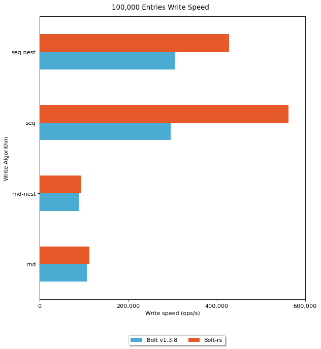
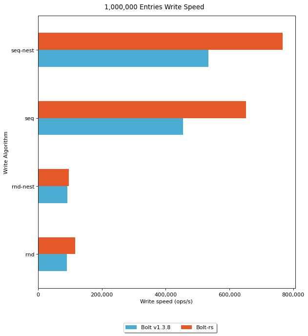
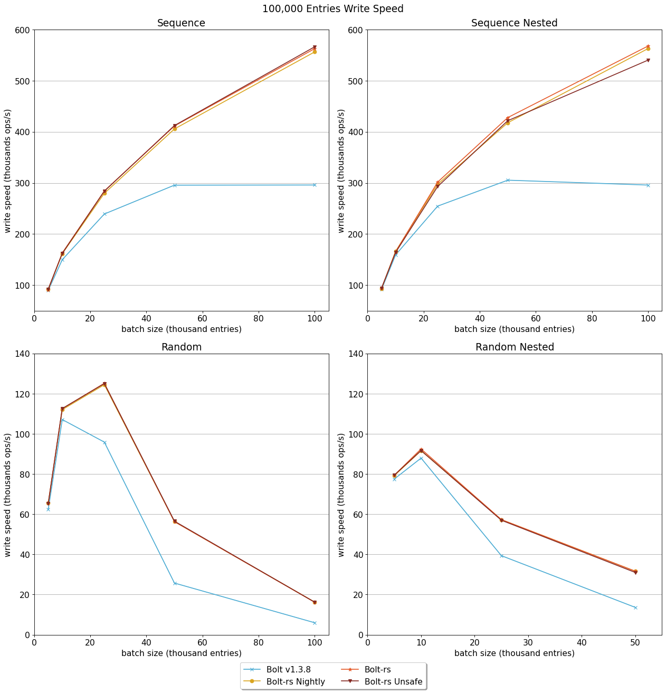
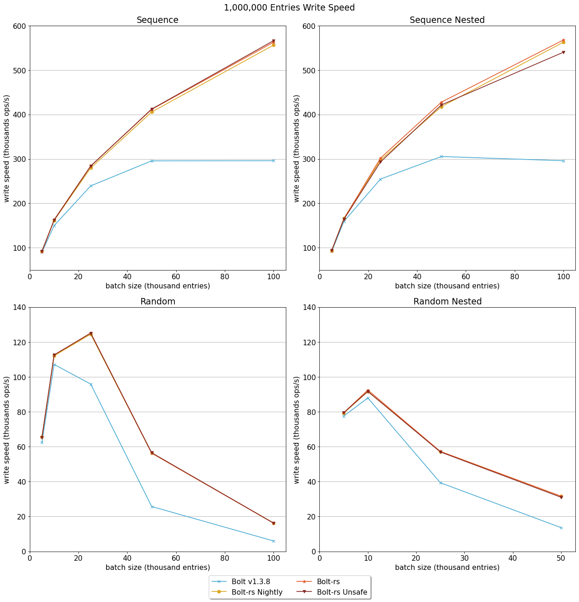
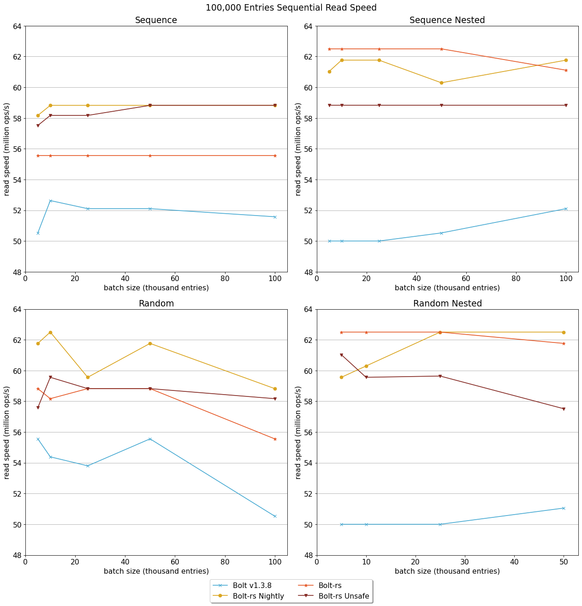
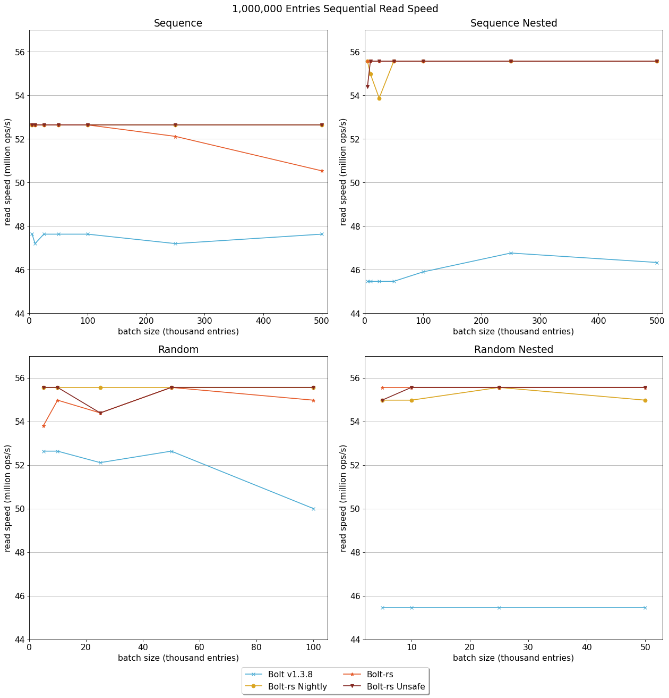
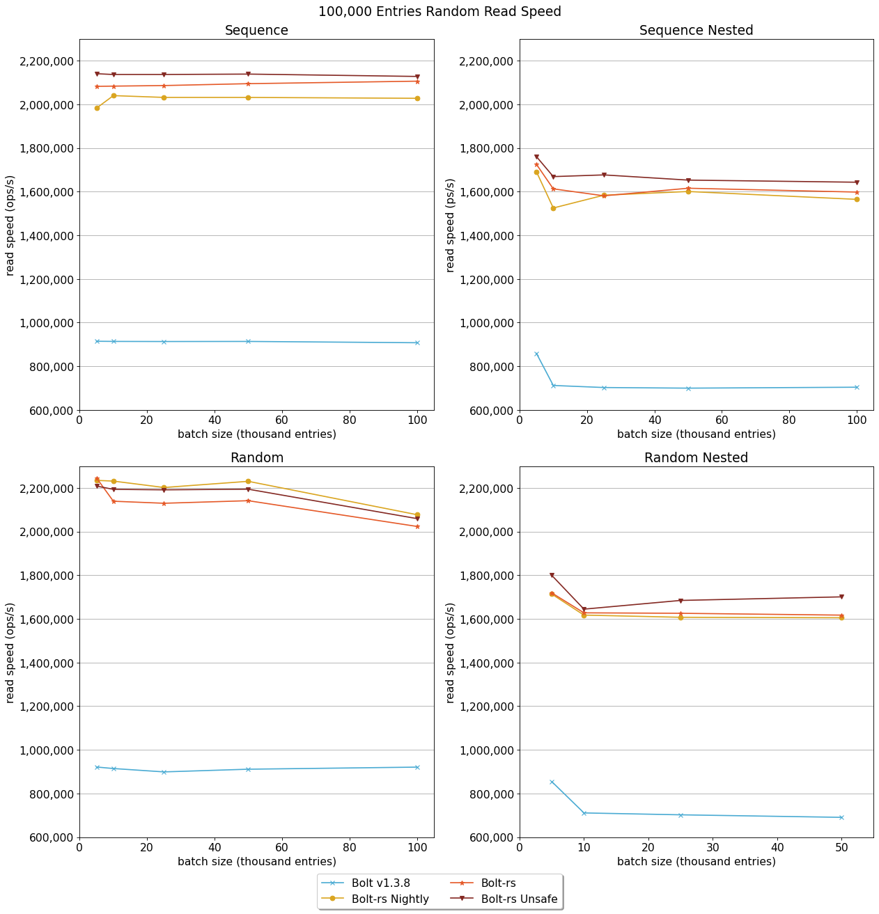
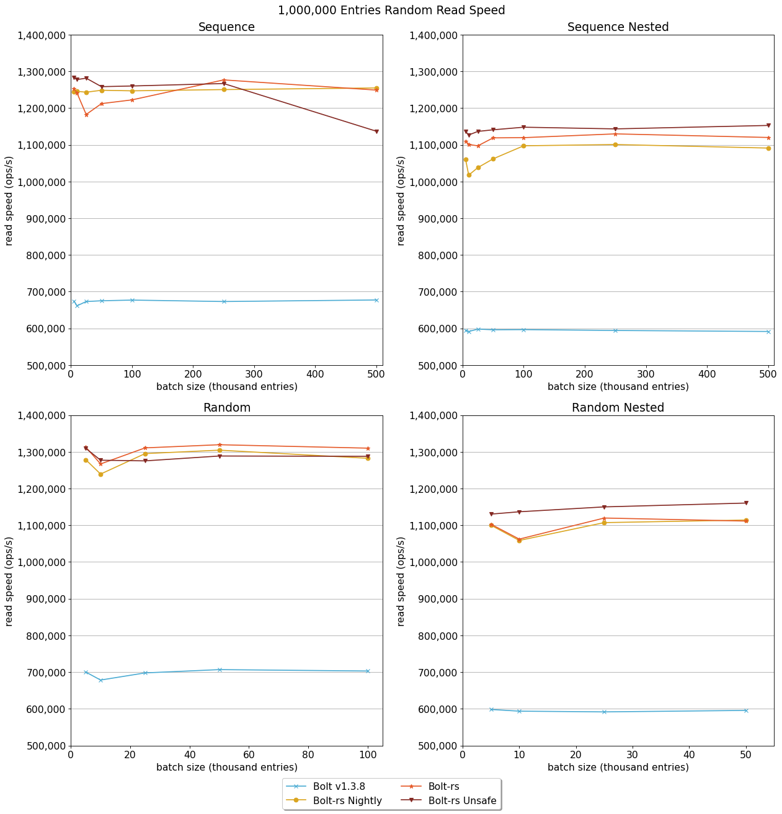
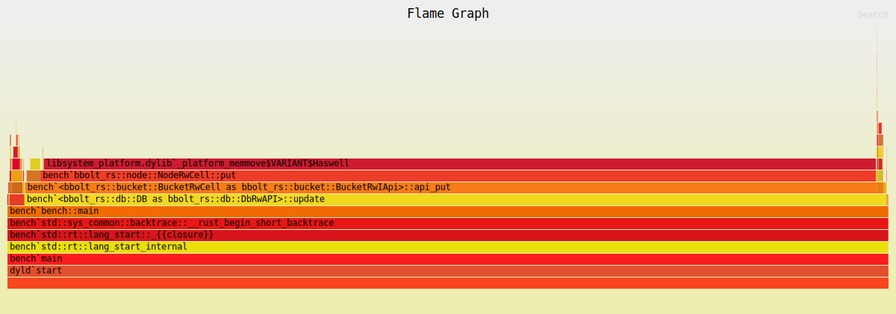

Announcing Bolt-rs 1.3.8!
====

```
 % ./target/release/bench -w seq -r seq
# Write 64.222771ms     (64.223µs/op)   (15570 op/sec)
# Read  1.000071951s    (17ns/op)       (58823529 op/sec)
```

With the above results, my hard work on my labor of love bear fruit. 
Over those months, I spent an inordinate amount of time reimplementing the Go [Bolt key-value database](https://github.com/etcd-io/bbolt) in Rust. 
This marks the culmination of my journey where I learned how to:
* Build a database
* Design a Rust-centric database architecture
* How to use API design to remove ["footguns"](https://en.wiktionary.org/wiki/footgun)

# Impetus

The project started in mid 2023 when I wanted to learn how ETCD and the Raft algorithm work.
This also led me to learn how the BBolt database works. 
I proceeded to follow in the software-engineering tradition of allowing curiosity to turn into an all-consuming case of [yak shaving](https://en.wiktionary.org/wiki/yak_shaving). 

# Project Standards
* Use only stable Rust
* Keep the library API as close to the original as possible
* The on-file representation _must_ match original code exactly
* Manage transaction memory without [Rc](https://doc.rust-lang.org/std/rc/struct.Rc.html)
* Unsafe behavior validated by Miri

# Performance Improvements

I benchmarked both codebases for read and write performance with 100,000 and a 1,000,000 entries.
Each comparison uses the Go library's best performing batch size. 

## Write Performance


| Write Algorithm |  seq-nest |       seq | rnd-nest |       rnd |
|-----------------|----------:|----------:|---------:|----------:|
| Batch Size      |    50,000 |   100,000 |   10,000 |    10,000 |
| Bolt Rust       | 427,775.7 | 562,519.0 | 92,443.5 | 112,511.3 |
| Bolt Go         | 305,376.4 | 295,973.3 | 87,892.8 | 107,071.9 |
| Improvement     |       40% |       90% |       5% |        5% |



| Write Algorithm |  seq-nest |       seq | rnd-nest |       rnd |
|-----------------|----------:|----------:|---------:|----------:|
| Batch Size      |   250,000 |   250,000 |   10,000 |    50,000 |
| Bolt Rust       | 767,554.5 | 651,574.2 | 95,847.7 | 116,768.2 |
| Bolt Go         | 534,464.9 | 454,243.4 | 91,458.8 |  89,782.6 |
| Improvement     |       44% |       43% |       5% |       30% |

## Read Performance


| Read Algorithm |      seq/seq | seq-nest/seq |      rnd/seq | rnd-nest/seq |
|----------------|-------------:|-------------:|-------------:|-------------:|
| Batch Size     |       10,000 |      100,000 |        5,000 |       50,000 |
| Bolt Rust      | 55,555,555.0 | 61,111,110.2 | 58,823,529.0 | 61,764,705.0 |
| Bolt Go        | 52,631,578.0 | 52,105,262.4 | 55,555,555.0 | 51,052,631.2 |
| Improvement    |           6% |          17% |           6% |          21% |

| Read Algorithm |     seq/rnd | seq-nest/rnd |     rnd/rnd | rnd-nest/rnd |
|----------------|------------:|-------------:|------------:|-------------:|
| Batch Size     |       5,000 |        5,000 |       5,000 |        5,000 |
| Bolt Rust      | 2,082,484.4 |  1,725,344.6 | 2,245,630.8 |  1,718,915.8 |
| Bolt Go        |   914,588.0 |    859,266.2 |   921,206.0 |    854,408.6 |
| Improvement    |        128% |         101% |        144% |         101% |


| Read Algorithm |      seq/seq | seq-nest/seq |      rnd/seq | rnd-nest/seq |
|----------------|-------------:|-------------:|-------------:|-------------:|
| Batch Size     |       10,000 |      100,000 |        5,000 |       50,000 |
| Bolt Rust      | 52,631,578.0 | 55,555,555.0 | 53,801,168.8 | 55,555,555.0 |
| Bolt Go        | 47,619,047.0 | 46,753,246.2 | 52,631,578.0 | 45,454,545.0 |
| Improvement    |          11% |          19% |           2% |          22% |

| Read Algorithm |     seq/rnd | seq-nest/rnd |     rnd/rnd | rnd-nest/rnd |
|----------------|------------:|-------------:|------------:|-------------:|
| Batch Size     |       5,000 |        5,000 |       5,000 |        5,000 |
| Bolt Rust      | 1,248,927.6 |  1,097,127.0 | 1,319,270.6 |  1,102,783.6 |
| Bolt Go        |   677,277.0 |    597,967.2 |   706,786.0 |    598,243.4 |
| Improvement    |         84% |          83% |         87% |          84% |

I expected some performance improvements just due to the nature of ahead-of-time (AOT) compilation.
It is surprising to see over double the performance in the Rust version for random access reads (everything ending in "/rnd") especially since sequential reads are so close.


More details can be found in the [In-Depth Performance Analysis](#in-depth-performance-analysis)

# API Improvements

## Lifetimes and Borrow Checking

While the performance improvements are nice, the biggest wins are the improvements to library users.
For example, let's compare the Bucket `get` function definition of the two implementations.

Go:
```go
// Get retrieves the value for a key in the bucket.
// Returns a nil value if the key does not exist or if the key is a nested bucket.
// The returned value is only valid for the life of the transaction.
func (b *Bucket) Get(key []byte) []byte {
```

Due to how Bolt is implemented the returned slice is only guaranteed to exist for the duration of the transaction.
Accessing this slice may result in a panic otherwise.

Rust:
```rust
  /// Get retrieves the value for a key in the bucket.
  /// Returns None if the key does not exist or if the key is a nested bucket.
  fn get<'a, T: AsRef<[u8]>>(&self, key: T) -> Option<&[u8]>;
```

Notice that the Rust version's documentation contains no warnings regarding the values returned.
Rust's borrow checker guarantees that:
* The returned value is valid
* The returned value cannot be modified
* The bucket cannot be modified nor can the transaction be committed as long as the returned value is in use

[There are some real benefits with Rust's guarantees.](https://robert.ocallahan.org/2017/02/what-rust-can-do-that-other-languages.html)
This is in no way, shape, or form shade on Bolt's developers.
Lifetimes are hard and documentation will only get you so far.

* [Fix code documentation: Apparent UB if value bytes passed to Put() are changed before committing](https://github.com/etcd-io/bbolt/issues/275)
* [why memory is freed? Disable bolt own garbage collector](https://github.com/etcd-io/bbolt/issues/298)
* [Update Bucket.Get documentation](https://github.com/etcd-io/bbolt/pull/498)
* [Copy Key Before Seek](https://github.com/etcd-io/bbolt/pull/639)

Additionally, using generics can improve the API and make writing code less noisy. 
For example, in the Go library all byte strings need to be prefaced with `[]byte`

```go
value := b.Get([]byte("foo"))
```

The Rust equivalent accepts any type that implements [`AsRef<[u8]>`](https://doc.rust-lang.org/std/convert/trait.AsRef.html).

```rust
let value = b.get("foo")
```

## Designing the API to Prevent Invalid Usage

Consider the following preconditions for the Transaction Commit function in the Go Bolt library.
```go
// Commit writes all changes to disk and updates the meta page.
// Returns an error if a disk write error occurs, or if Commit is
// called on a read-only transaction.
func (tx *Tx) Commit() error {
	_assert(!tx.managed, "managed tx commit not allowed")
	if tx.db == nil {
		return ErrTxClosed
	} else if !tx.writable {
		return ErrTxNotWritable
	}
```

Before a commit can occur, the transaction must:
1. Ensure Commit isn't called while inside a `tx.Update` managed function.
2. Ensure it hasn't already been committed or rolled back.
3. Ensure it is writable

The first and third check could be eliminated by returning wrapped transaction objects implementing only the valid functions.
The second check cannot be eliminated in Go as it's trivial to copy pointers.
Again, there's no shade on Bolt's developers.
That's how you do it.
Similar checks exist throughout the Bolt codebase.

The Rust version has the following Transaction API (most functions omitted):
```rust
/// Check performs several consistency checks on the database for this transaction.
/// An error is returned if any inconsistency is found.
pub trait TxCheck<'tx> {
  fn check(&self) -> Vec<String>;
}

/// Read-only transaction API
pub trait TxApi<'tx>: TxCheck<'tx> {
  /// Bucket retrieves a bucket by name.
  /// Returns None if the bucket does not exist.
  fn bucket<T: AsRef<[u8]>>(&self, name: T) -> Option<BucketImpl<'tx>>;
}

/// RW transaction API
pub trait TxRwRefApi<'tx>: TxApi<'tx> {
  /// CreateBucket creates a new bucket.
  /// Returns an error if the bucket already exists, if the bucket name is blank, or if the bucket name is too long.
  fn create_bucket<T: AsRef<[u8]>>(&mut self, name: T) -> crate::Result<BucketRwImpl<'tx>>;
}

/// RW transaction API + Commit
pub trait TxRwApi<'tx>: TxRwRefApi<'tx> {

  /// commit writes all changes to disk and updates the meta page.
  /// Returns an error if a disk write error occurs
  fn commit(self) -> crate::Result<()>;
}
```

The change in API handles all 3 scenarios and won't allow a transaction to be used incorrectly.

The `tx.Update` managed function is passed an struct implementing`TxRwRefApi`. 
The `commit` function doesn't exist for it.
A transaction with the `commit` function must also, by definition, be writable.  
Lastly, a transaction is unique since it doesn't implement `Clone` or `Copy`.
Since `commit` (and `rollback`) consumes `self` we guarantee they can't be called on stale transactions.

Additionally, notice the `'tx` lifetime.
You'll see it used throughout the API.
The lifetime ensures that all references and resources associated with the transaction cannot escape the transaction.
This substantially simplifies the API's usage and prevents many common errors from occurring without the need for runtime checks.

# In-Depth Performance Analysis

## Methods

### Software

The Rust version is a port of [BBolt's v1.3.8 tag](https://github.com/etcd-io/bbolt/tree/v1.3.8).

```shell
$ go version
go version go1.22.2 darwin/amd64
```

The Go version is compiled using `go build` with some [minor code additions](https://github.com/etcd-io/bbolt/pull/711) to support benchmarking random access.

```shell
$ rustc --version
rustc 1.77.2 (25ef9e3d8 2024-04-09)
```

Two Rust versions were built for the performance comparison.
* `cargo build --release`: Release build with thin link time optimizations enabled
* `cargo build --release --features=allgasnobrakes`: Same as above and additionally disables RefCell runtime checks. Shown as 'unsafe' in the graphs
* `cargo +nightly build --release`: Release build with thin link time optimizations enabled using the nightly compiler

### OS and Hardware

All performance metrics were gathered on a MacBook Pro

```shell
$ system_profiler SPSoftwareDataType SPHardwareDataType
Software:

    System Software Overview:

      System Version: macOS 14.4.1 (23E224)
      Kernel Version: Darwin 23.4.0
      Boot Volume: Macintosh HD
      Boot Mode: Normal
      Computer Name: Mechagodzilla
      User Name: Adam Baxter (<snip>)
      Secure Virtual Memory: Enabled
      System Integrity Protection: Enabled
      Time since boot: <snip>

Hardware:

    Hardware Overview:

      Model Name: MacBook Pro
      Model Identifier: MacBookPro15,1
      Processor Name: 6-Core Intel Core i7
      Processor Speed: 2.6 GHz
      Number of Processors: 1
      Total Number of Cores: 6
      L2 Cache (per Core): 256 KB
      L3 Cache: 12 MB
      Hyper-Threading Technology: Enabled
      Memory: 16 GB
      System Firmware Version: 2022.100.22.0.0 (iBridge: 21.16.4222.0.0,0)
      OS Loader Version: 580~1678
      Serial Number (system): <snip>
      Hardware UUID: <snip>
      Provisioning <snip>
      Activation Lock Status: Enabled
```

### Analysis
The [benchmark scripts](./scripts) run each benchmark 5 times.
The results are catted together and the metrics were analyzed using [Jupyter Lab](https://jupyter.org/).
The scores represent the average operations per second per option.
Benchmark results and the Jupyter Notebook used to create the graphs can be found [here](https://github.com/ambaxter/datascience/tree/main/bbolt_comparison).
The Go version's best performing batch size will be used when comparing performance.

The benchmark options are

Write algorithm:
* `seq`: Element keys are incrementing integers stored in a single bucket
* `rnd`: Element keys are randomly generated integers stored in a single bucket
* `seq-nest`: Keys are monotonically incrementing integers stored in nested monotonically incrementing buckets.
  Each bucket stores a batch size number of elements
* `rnd-nest`: Keys are randomly generated integers stored in nested randomly generated buckets.
  Each bucket stores a batch size number of elements

Transactions are committed after a batch size number of elements is added until the element total is reached.

Read algorithm:
* `seq`: Sequentially iterate through all entries as many times as possible in a second.
* `rnd`: Randomly access all entries as many times as possible in a second.

Element total:
* 100,000
* 1,000,000

Batch sizes:
* 5,000
* 10,000
* 25,000
* 50,000
* 100,000
* 250,000

Batch sizes larger than element total are skipped.

Note: There are results for a 500,000 batch size, but due to performance limitations with random writes I've left them out.




Random writes suffer greatly as batch size increases.
This is discussed later in [Future Improvements](#random-writes)







# Future Improvements

## Random Writes
In both the 100,000 and 1 million entry write runs, the random write performance suffers dramatically as the batch size increases as described in [bbolt's documentation](https://github.com/etcd-io/bbolt?tab=readme-ov-file#caveats--limitations):

>Bolt is good for read intensive workloads. Sequential write performance is also fast but random writes can be slow. You can use DB.Batch() or add a write-ahead log to help mitigate this issue.

and

> Bulk loading a lot of random writes into a new bucket can be slow as the page will not split until the transaction is committed. Randomly inserting more than 100,000 key/value pairs into a single new bucket in a single transaction is not advised.

In the flamegraph this presents as memmove dominating time spent.


Inodes are backed by an ordered array in both versions.
For each insert, every node after the new key needs to be moved over by one to make room.
This doesn't scale.
I think replacing the Inode array with a [BTreeMap](https://doc.rust-lang.org/std/collections/struct.BTreeMap.html) will solve this limitation.
Changing this is blocked until the [allocator-api](https://doc.rust-lang.org/unstable-book/library-features/allocator-api.html) is stabilized. 

## More Cache Friendly Data Storage

[This paper](https://dl.acm.org/doi/abs/10.1145/3293883.3295704) suggests reorganizing the leaf page to be more cache friendly could increase performance by decreasing the number of cache misses.


The leaf page is currently laid out like
```
 Leaf Element Page
      ┌──────┐
      │ Page │
      │Header│
      ├──────┤
      │Elem 0│
      ├──────┤
      │Elem 1│       key ptr =
      ├──────┤  elem ptr + elem.pos
      │Elem 2│   ┌─── ┌───┐
      ├──────┤   │    │ k │
      │ .... │   │    │ e │
      ├──────┤───┘    │ y │
      │K/V 0 │        │ v │
      ├──────┤───┐    │ a │
      │K/V 1 │   │    │ l │
      ├──────┤   │    │ u │
      │K/V 2 │   │    │ e │
      ├──────┤   └─── └───┘
      │ .... │
      └──────┘
```

A more cache friendly version might look like 

```                      
   Cache Friendly                       
    Element Page                        
      ┌──────┐                          
      │ Page │                          
      │Header│                          
      ├──────┤                          
      │Elem 0│                          
      ├──────┤                          
      │Elem 1│                          
      ├──────┤                          
      │Elem 2│                          
      ├──────┤                          
      │ .... │                          
      ├──────┤           key ptr =      
      │Key 0 │◀──── elem ptr + elem.pos 
      ├──────┤                          
      │Dist 0│                          
      ├──────┤                          
      │Key 1 │                          
      ├──────┤                          
      │Dist 1│                          
      ├──────┤                          
      │Key 2 │                          
      ├──────┤                          
      │Dist 2│                          
      ├──────┤                          
      │ .... │                          
      ├──────┤          value ptr =     
      │Val 0 │◀────   dist ptr + dist   
      ├──────┤                          
      │Val 1 │                          
      ├──────┤                          
      │Val 2 │                          
      ├──────┤                          
      │ .... │                          
      └──────┘                                         
```

## A WAL
Bolt has no WAL.
Adding a WAL would remove one of the last remaining possible deadlocks inherent in the Bolt code. 
Throughput might be faster, too!

# Special Thanks
* [BBolt team](https://github.com/etcd-io/bbolt) for making such a great project to learn from
* [Built-Your-Own-Database](https://build-your-own.org/database/) For the great refresher on database fundamentals
* [Monodraw](https://monodraw.helftone.com/) for the most amazing ASCII diagram program I've ever used
* [Jupyter Lab](https://jupyter.org/) for making all of this [data analysis](https://github.com/ambaxter/datascience) a dream